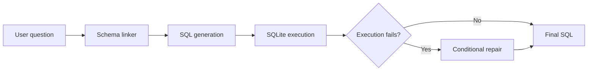
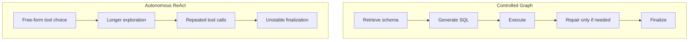

# text2sql-agent

## TL;DR

This repository is a compact Text2SQL systems project centered on a fixed compact development subset of BIRD dev `california_schools`, with an additional full frozen-manifest comparison across `1534` BIRD dev samples. On the compact subset, the main pipeline improves from `26%` to `34%` to `36%` EX, a `38.5%` relative EX gain over the baseline, and raises `VSR` from `86%` to `100%`.

The repo also includes an agent-control ablation: a controlled execution-repair graph reaches `EX=32%`, while an autonomous ReAct agent drops to `EX=12%`. The main takeaway is that when task structure is known, explicit control beats free-form tool use in this setup.





## Why This Repo Is Worth Reading

- It shows a practical Text2SQL stack rather than a single-prompt demo.
- It isolates where gains come from: schema linking, prompt tightening, and execution-guided repair.
- It includes a useful negative ablation: more agent freedom performed worse.
- It keeps scope honest: this is not a leaderboard submission and does not claim full BIRD coverage.

## Main Results

### Compact development subset

| Method | EX | VSR | Takeaway |
| --- | ---: | ---: | --- |
| Full-schema direct prompting baseline | 26% | 86% | weak baseline |
| Schema-linked prompting + prompt constraints | 34% | 88% | schema retrieval helps semantics |
| Schema-linked execution-repair pipeline | 36% | 100% | best overall pipeline |

- EX improves from `26%` to `34%` to `36%`.
- Going from `26%` to `36%` is a `38.5%` relative EX improvement over the naive baseline.
- VSR improves from `88%` to `100%` once strict repair is added.

### Expanded full-dev frozen manifest

| Method | Samples | EX | VSR | Main Role |
| --- | ---: | ---: | ---: | --- |
| Full-schema direct prompting | 1534 | 51.11% | 95.63% | baseline |
| Schema-linked prompting + constraints | 1534 | 55.41% | 97.39% | schema grounding |
| Schema-linked execution-repair pipeline | 1534 | 56.45% | 99.80% | best overall |
| DDL-style schema serialization | 1534 | 55.93% | 97.78% | schema format ablation |

- Schema linking improves EX by `+4.30` percentage points over full-schema prompting on the full frozen manifest.
- Execution-guided repair raises VSR to `99.80%` and remains the best overall configuration.
- DDL-style serialization is slightly better than schema-linked prompting alone on full eval, but still below execution repair.
- The detailed expanded write-up is in [docs/expanded_evaluation.md](/Users/bytedance/text2sql_agent/docs/expanded_evaluation.md:1).

### Agent ablation

| Agent setting | EX | VSR | Interpretation |
| --- | ---: | ---: | --- |
| Controlled execution-repair agent | 32% | 98% | stable graph, near the main pipeline |
| Autonomous ReAct agent | 12% | 88% | negative ablation |

- The controlled graph outperforms autonomous ReAct by `20` EX points: `32%` vs `12%`.
- The result suggests that in this repo, free-form tool calling added overhead and instability instead of better reasoning.

### Full snapshot

| Method | EX | VSR | Role |
| --- | ---: | ---: | --- |
| Full-schema direct prompting baseline | 26% | 86% | baseline |
| Schema-linked prompting + prompt constraints | 34% | 88% | improved baseline |
| Schema-linked execution-repair pipeline | 36% | 100% | main result |
| Controlled agent trace implementation | 32% | 98% | controlled graph |
| Few-shot retrieval | 28% | 100% | negative ablation |
| DDL-style schema serialization ablation | 28% | 82% | negative ablation |
| Autonomous ReAct agent | 12% | 88% | negative ablation |

## Method

The repository focuses on a simple, explicit pipeline:

1. retrieve task-relevant schema items with hybrid linking,
2. generate SQL from the linked schema context,
3. execute the SQL against SQLite,
4. repair only when execution fails,
5. return the final SQL candidate.

This is intentionally closer to an enterprise BI workflow than to a pure prompt-only benchmark setup.

## Agent Runtime Backend

The iterative agent calls database tools through a `ToolExecutor` layer. The default backend is still `local`, which uses the existing Python implementation. Passing `--tool-backend mcp` switches the same agent loop to MCP-served tools over stdio:

```bash
PYTHONPATH=src python3 scripts/run_iterative_agent.py --db-id california_schools --limit 3 --tool-backend mcp --memory-mode working
```

Memory is backend-agnostic: `WorkingMemory` and `EpisodicMemory` only record normalized tool observations after the agent loop calls the configured executor. They do not call local or MCP tools directly.

The MCP backend is validated with fixed tool-call parity and small smoke runs only:

```bash
PYTHONPATH=src python3 scripts/compare_tool_backends.py
PYTHONPATH=src python3 scripts/run_mcp_backend_smoke.py --limit 3 --max-steps 2
```

The parity report is written to `results/iterative_agent/backend_parity_report.json`. These checks do not constitute a stratified-300 or full-dev MCP benchmark, and this repo does not claim MCP backend performance gains.

## When Does Agency Hurt?

- Controlled execution-repair agent: `EX=32%`, `VSR=98%`
- Autonomous ReAct agent: `EX=12%`, `VSR=88%`
- Finding: free-form tool calling caused over-exploration and finalization instability.
- This supports using a controlled graph when task structure is known.

## Scope And Evaluation

All reported numbers in the repo are based on:

- compact development subset: BIRD dev `california_schools`, fixed `50` samples
- expanded evaluation: full BIRD dev frozen manifest, fixed `1534` samples
- saved result artifacts already committed under `results/`

Difficulty distribution of the subset:

- `simple = 15`
- `moderate = 16`
- `challenging = 19`

Metrics:

- `EX`: execution-match accuracy
- `VSR`: valid SQL rate

This project does not claim full BIRD benchmark coverage or leaderboard-valid results.

## Internal Experiment Aliases

Historical scripts, file names, and result artifacts still use internal experiment aliases:

- `Day2` = Full-schema direct prompting baseline
- `Day3` = Schema-linked prompting + prompt constraints
- `Day5.5` = Schema-linked execution-repair pipeline
- `Day6` = DDL-style schema serialization ablation

These labels are retained for experiment continuity only. The public-facing method names in this README and the docs are the canonical names.

## Model Settings

- Core generation and repair pipelines use the repository DeepSeek client setting.
- In code, the core pipeline default is `deepseek-chat`; see [src/text2sql/llm.py](/Users/bytedance/text2sql_agent/src/text2sql/llm.py:10).
- Later agent experiments use DeepSeek function-calling settings; see [src/text2sql/agents/react_agent.py](/Users/bytedance/text2sql_agent/src/text2sql/agents/react_agent.py:21).
- This project does not claim cross-model robustness.

## Installation

```bash
pip install -r requirements.txt
export DEEPSEEK_API_KEY=...
```

## Quick Start

Run the schema-linked pipeline:

```bash
PYTHONPATH=src python3 scripts/run_schema_linked.py --db-id california_schools --limit 50 --promptfix
```

Run strict execution repair on top of the saved schema-linked predictions:

```bash
PYTHONPATH=src python3 scripts/run_strict_repair.py
```

Useful additional entrypoints:

```bash
PYTHONPATH=src python3 scripts/run_controlled_agent.py --db-id california_schools --limit 50
PYTHONPATH=src python3 scripts/run_agent.py --db-id california_schools --limit 50
PYTHONPATH=src python3 scripts/run_iterative_agent.py --db-id california_schools --limit 50 --tool-backend local
PYTHONPATH=src python3 scripts/compare_controlled_with_day5.py
```

Or use the included `Makefile`:

```bash
make compile
make eval-schema-linked
make eval-repair
make eval-controlled-agent
```

## Project Structure

- `src/text2sql/` contains the active package code.
- `scripts/` contains runnable CLI entrypoints.
- `results/` contains the frozen summaries used by the README.
- `docs/` contains writeups and analysis notes.
- `archive/` has been removed from `main` to keep the repository focused on the active package and headline results.

For the cleanup note, see [docs/archive_plan.md](/Users/bytedance/text2sql_agent/docs/archive_plan.md:1). The pre-cleanup history is preserved on the local branch `full-experiment-history`.

## Notes On Interpretation

- The schema-linked execution-repair pipeline is the canonical main result.
- The controlled agent is a trace-oriented near-match implementation, not the canonical metric run.
- The autonomous ReAct agent is intentionally kept as a negative ablation.

For the longer write-up, see [docs/error_analysis.md](/Users/bytedance/text2sql_agent/docs/error_analysis.md:1).
